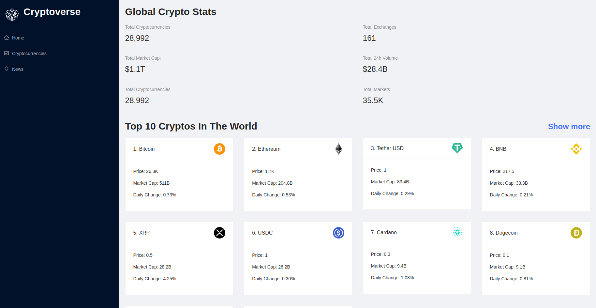

<h1 align="center">Cryptoverse</h1>

  

    Website implemented using React.js
     
     
    <a href="https://cryptoverse-azimovs.netlify.app/">View Demo</a>
    ·
    <a href="https://github.com/AzimovS/cryptoverse/issues">Report Bug</a>
    ·
    <a href="https://github.com/AzimovS/cryptoverse/issues">Request Feature</a>
  

<!-- ABOUT THE PROJECT -->

  

The website lets you see the latest global cryptocurrency stats, top cryptocurrencies, and news. Also, there is a chance to see the chart and stats for the selected cryptocurrency. The website was developed with the [Javascript Mastery tutorial](https://www.youtube.com/watch?v=9DDX3US3kss&ab_channel=JavaScriptMastery).

### Built With
* [React](https://react.dev/)
* [Ant Design](https://ant.design/)
* [Redux toolkit](https://redux-toolkit.js.org/)
* [Chart js](https://www.chartjs.org/)

